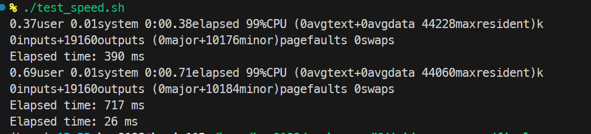

# JPEG Decoder and Speed Test

# 先允許執行權限
```bash
chmod +x make.sh
chmod +x test_speed.sh
```
# 首先你要先跑make.sh 編譯jpeg_decoder, jpeg_decoder_old

```bash
bash make.sh
```
# 然後執行 test_speed.sh 來測試速度
```bash
bash test_speed.sh
```

# 最終截圖



# 修正版是從以下專案修改而來
https://github.com/MROS/jpeg_decoder